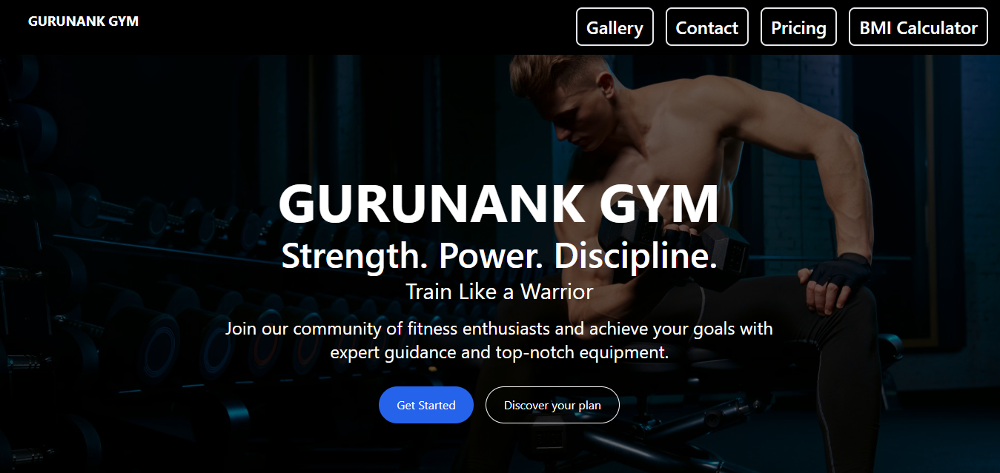
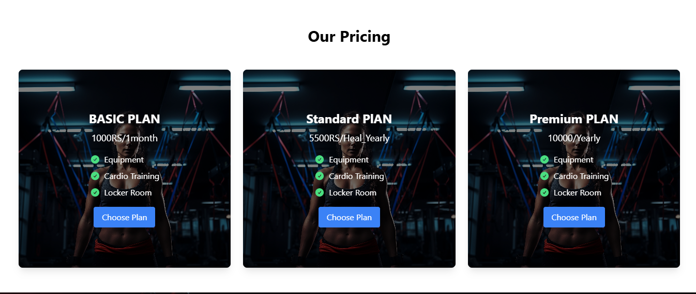
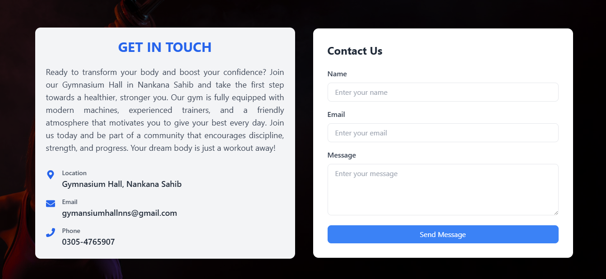
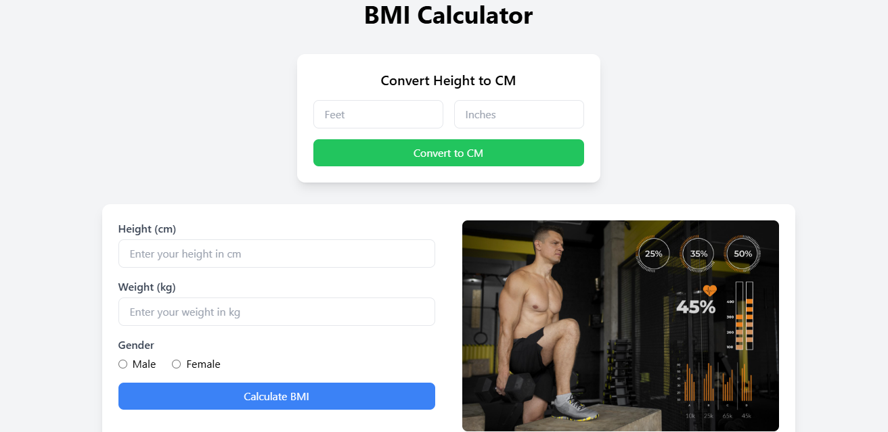

# 🏋️‍♂️ Modern Gym Website (React + Tailwind CSS)

Welcome to my fully responsive and modern **Gym Website** built using **React.js** and **Tailwind CSS**. This vibrant and colorful web application provides all essential gym information, including workout details, facilities, timings, pricing plans, contact options, and a BMI calculator to help users assess their fitness level.

🌐 **Live Website**: [https://gurunankgym.netlify.app/](https://gurunankgym.netlify.app/)

---

## 🚀 Features

- 🎨 Fully modern UI with **Tailwind CSS**
- ⚙️ Built with **React.js**
- 📱 100% **Responsive Design** (mobile, tablet, desktop)
- 🏋️‍♀️ **Workout Section** with detailed routines and timings
- 🏢 **Facilities & Food** guidelines included
- 💵 **Pricing Plans** clearly displayed
- 📬 **Contact Form** for direct connection
- 📊 **BMI Calculator** to analyze user fitness level

---

## 🖼️ Screenshots

### 🏠 Home Page  

### 🏋️ Workout Page  

### 💰 Pricing Page  

### ✉️ Contact Page  

### ⚖️ BMI Calculator Page  

---

## 🛠️ Tech Stack

- **Frontend:** React.js, Tailwind CSS
- **Design:** Fully custom and responsive layout
- **Deployment:** Netlify and railway

---

## 📫 Contact Me

- 📧 Email: Add through contact form
- 💼 [LinkedIn](https://www.linkedin.com/in/gulfam-shair-559b0a338)  
- 💻 [GitHub](https://github.com/raigulukharal)  

---

